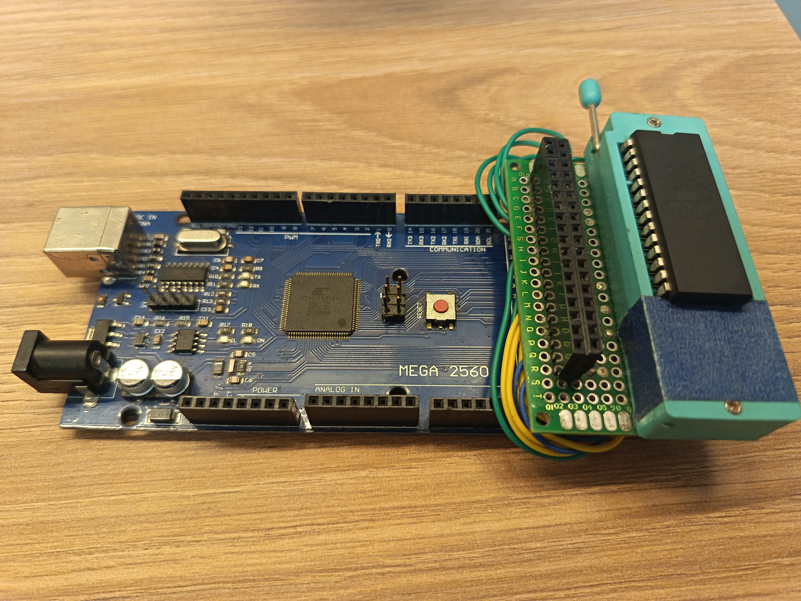
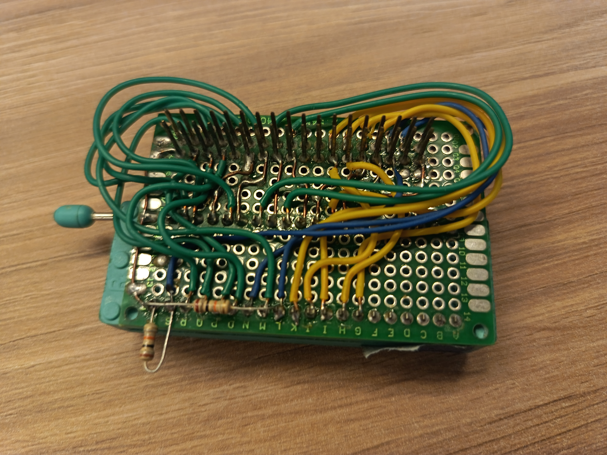
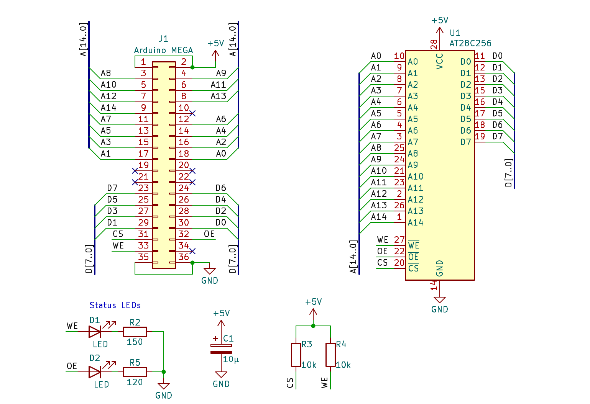

# EEPROM Programmer

Code to program an AT28C256 EEPROM using an Arduino MEGA. Consists of [firmware](firmware) for an Arduino Mega 2560, and an [uploader](uploader) that talks to the firmware via serial USB.

## Hardware

The firmware is designed to work with a custom-made board that can be inserted on top of the Arduino's side pin column.

|  |  |
| :-------------------------------------------------------: | :---------------------------------------------------------------------------: |

The schematic is as follows:



The pins labeled "Arduino MEGA" go on top the rightmost header columns of the Arduino.

## Usage

The uploader can be used as follows:

```bash
# You may specify a chain of "commands" to execute. More on commands below.

# Unlock, write a file, and lock again
eeprom-programmer \
    'unlock' \
    'write <file.bin>' \
    'lock'

# Read the EEPROM's first 256 bytes into out.bin
eeprom-programmer 'read out.bin --len=256'

# Doom
eeprom-programmer 'erase'
```

The CLI supports the following commands:

- `read <FILE> [--start=<ADDR>] [--len=<NUM>]`: Dumps the EEPROM's contents to `<FILE>`.
- `write <FILE> [--no-verify] [--verify-attempts=<NUM>]`: Writes `<FILE>` to the EEPROM starting at address 0.
- `verify <FILE> [--fix] [--max-attempts=<NUM>]`: Verifies the EEPROM against `<FILE>`.
- `unlock`: Executes the software data protection (SDP) disable algorithm.
- `lock`: Executes the SDP enable algorithm.
- `erase`: Executes the software chip erase algorithm.

## References

- [AT28C256 Datasheet](https://ww1.microchip.com/downloads/aemDocuments/documents/MPD/ProductDocuments/DataSheets/AT28C256-Industrial-Grade-256-Kbit-Paged-Parallel-EEPROM-Data-Sheet-DS20006386.pdf)
- [Software Chip Erase](http://ww1.microchip.com/downloads/en/Appnotes/doc0544.pdf)
- [Parallel EEPROM Data Protection](http://ww1.microchip.com/downloads/en/Appnotes/DOC0543.PDF)
